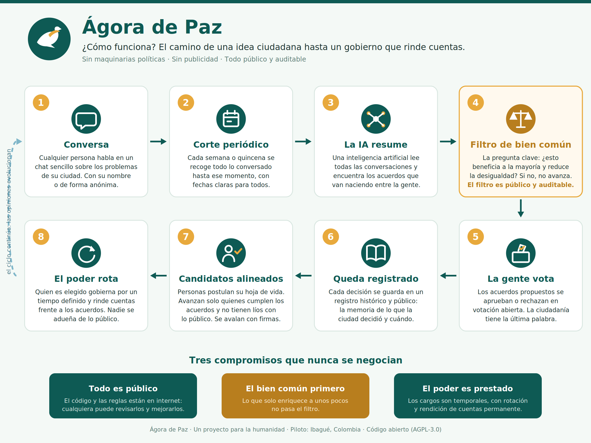

# Ágora de Paz — Plataforma de Gobernanza Participativa Mediada por IA

> **Un proyecto para la humanidad.** La paz como fundamento: construir consensos ciudadanos es construir paz. Prueba piloto: **Ibagué, Tolima, Colombia (2026–2027)**.
>
> Proyecto de investigación aplicada en gobernanza digital, democracia participativa y transparencia algorítmica. 100% código abierto, donado a la humanidad para que cualquier comunidad del mundo pueda adoptarlo.



*El proceso en 8 pasos: cualquier persona conversa, la IA resume los acuerdos, el filtro de bien común los evalúa, la ciudadanía vota, todo queda registrado públicamente, y de ahí emergen candidaturas alineadas con mandato temporal. El ciclo se repite porque las opiniones evolucionan.*

---

## 1. Problema

En Colombia, los procesos electorales tradicionales reproducen patrones de corrupción, concentración de poder y falta de representación genuina. Los liderazgos políticos tienden a perpetuarse en los cargos, a vivir de lo público y a ejecutar políticas que no priorizan el bien común. No existe un mecanismo transparente donde la ciudadanía construya colectivamente una visión de futuro y seleccione representantes que realmente la encarnen.

## 2. Visión

Una plataforma de código abierto que democratiza la construcción de proyectos políticos mediante inteligencia artificial, transparencia radical y participación ciudadana. El objetivo es transformar cómo se eligen liderazgos: no mediante publicidad tradicional ni maquinarias políticas, sino mediante **consensos construidos colectivamente**, filtrados por criterios explícitos de bien común y documentados públicamente.

### Evolución en dos fases

1. **Fase de consensos**: conversación ciudadana → síntesis por IA → votación cíclica → consensos validados y documentados.
2. **Fase de candidaturas**: postulación por hoja de vida → filtrado por IA contra los consensos aprobados → validación ciudadana mediante recolección de firmas → candidaturas con mandato temporal y rendición de cuentas.

### Prueba piloto

La primera implementación será en **Ibagué**, capital del Tolima, con miras a las próximas elecciones territoriales. Pero el horizonte es la **humanidad entera**: si el modelo funciona, cualquier ciudad, región o país del mundo puede adoptarlo, adaptarlo a su contexto (idioma, marco legal, mecanismos de participación) y contribuir de vuelta a la comunidad global.

---

## 3. Principios Innegociables

1. **La paz como fundamento.** La paz no es solo ausencia de violencia: es el resultado de consensos legítimos, política social y bien común. La plataforma existe para reemplazar la confrontación por la deliberación — construir consensos ciudadanos es construir paz.

2. **El bien común prima siempre.** Toda idea, política o candidatura se evalúa primero contra la pregunta: *¿esto reduce la desigualdad y beneficia a la mayoría?* Si el desarrollo económico solo enriquece a quienes ya concentran capital, no hay bien común. Este es el criterio de éxito número uno y es **público y auditable**.

3. **Transparencia radical.** Todo el código, los algoritmos, los criterios de evaluación y los datos de consenso son públicos en GitHub. La ciudadanía puede auditar cómo funciona la IA, hacer fork y proponer cambios.

4. **Participación abierta con dos carriles.**
   - **Con identidad verificada**: suma credibilidad y mayor peso en la ponderación de consensos.
   - **Anónima**: abierta a quien tenga temor legítimo de exponerse; participa sin penalización pero con menor peso en las votaciones.

5. **Rotación del poder.** Las personas elegidas son **custodias temporales del consenso**, no dueñas del poder. Cumplen una función por un tiempo definido, sin perpetuarse ni adueñarse de lo público.

6. **Evaluación basada en evidencia, no en etiquetas ideológicas.** Las ideas se contrastan contra indicadores reales de calidad de vida y contra experiencias exitosas de otros países (educación, salud, desigualdad, seguridad, desarrollo rural), tomando lo que ha funcionado sin importar de qué corriente provenga.

7. **Independencia tecnológica.** Se prioriza software libre y modelos de IA ejecutados localmente (no dependencia de APIs comerciales), para garantizar autonomía, gratuidad y reproducibilidad.

---

## 4. El Motor de Consenso

### Flujo general

```
Conversación abierta en chat
          ↓
   Corte temporal (semanal / quincenal)
          ↓
   Síntesis de temas por IA
          ↓
   Filtro de bien común (público y auditable)
          ↓
   Propuesta de consensos
          ↓
   Votación ciudadana abierta (con fechas definidas)
          ↓
   Resultados guardados y documentados
          ↓
   Siguiente ciclo (la conversación evoluciona)
```

### 4.1 Conversación abierta

La interfaz es un **chat simple y conversacional**, sin formularios complejos ni fricción. La IA abre con preguntas del tipo:

- "¿Cuál es el mayor desafío que ves en Ibagué hoy?"
- "¿Qué necesita cambiar en educación?"
- "¿Cómo debería ser la seguridad en tu barrio?"

El ciudadano puede elegir temáticas sugeridas al inicio o hablar abiertamente. Conforme conversa, la IA sugiere temáticas relacionadas para profundizar.

### 4.2 Cortes temporales

Las opiniones políticas **evolucionan** con la información y los resultados de las políticas. Por eso la conversación corre de forma continua, pero en momentos definidos (cada semana o quincena) la plataforma **congela y procesa** todo lo dicho hasta ese punto. Cada ciclo tiene fechas claras de apertura y cierre de votación.

### 4.3 Síntesis por IA

La IA lee las conversaciones del período, identifica temas comunes, agrupa por dominio (seguridad, educación, economía, salud, ruralidad, etc.) y sintetiza posiciones emergentes.

**Ejemplo ilustrativo:**
- 340 ciudadanos hablaron de educación.
- Mayoría señala baja calidad y falta de recursos docentes.
- Alta recurrencia de la prioridad en educación rural.

Síntesis propuesta: *"Consenso emergente: Ibagué necesita inversión urgente en educación rural, con recursos para docentes e infraestructura."*

### 4.4 Filtro de bien común

Cada síntesis pasa por un filtro con criterios **explícitos y públicos**:

- ¿Mejora la calidad de vida de quienes menos tienen?
- ¿Reduce la concentración de poder o de capital?
- ¿Es redistributiva o acumulativa?
- ¿Beneficia a la comunidad entera o a un grupo privilegiado?

Si una síntesis no pasa el filtro, la IA la marca como no alineada y sugiere ajustes. El código del filtro vive en este repositorio: cualquiera puede auditarlo y cuestionarlo.

### 4.5 Votación ciudadana

Cada consenso propuesto va a **votación abierta en un período con fecha definida**.

Ponderación sugerida (ajustable y documentada):
- Participante con identidad verificada: **1.0 voto**.
- Participante anónimo: **0.5 votos**.

Reglas:
- Consenso **aprobado** si supera el umbral definido (p. ej. >50%).
- Consenso **rechazado** si no lo alcanza.
- La comunidad puede proponer ajustes dentro del mismo período.

### 4.6 Registro histórico

Todos los consensos (aprobados y rechazados) se documentan públicamente con timestamp, número de votos y evolución en el tiempo. Este registro permite:

- Ver **cómo pensó la ciudad a lo largo del tiempo**.
- Ejercer **rendición de cuentas**: contrastar lo que prometen y hacen los elegidos contra los consensos que la ciudadanía pidió.

### 4.7 Selección de candidaturas

Sobre los consensos validados:

1. Personas interesadas **suben su hoja de vida** a la plataforma.
2. La IA calcula un **score de alineación** entre el perfil/propuestas de cada persona y los consensos aprobados.
3. Filtros de integridad: sin investigaciones ni antecedentes relevantes, sin historial de enriquecimiento con lo público, favoreciendo rotación y renovación.
4. La comunidad valida mediante **recolección de firmas** (mecanismo legal colombiano de grupos significativos de ciudadanos).
5. Las candidaturas resultantes representan el proyecto político construido colectivamente, con **mandato temporal** y rendición de cuentas contra el registro histórico de consensos.

---

## 5. Arquitectura Técnica

### Decisiones de stack (100% software libre y gratuito)

| Capa | Tecnología | Justificación |
|---|---|---|
| Backend | **Python + FastAPI** | Ecosistema más maduro para orquestación de LLMs locales; integración natural con Ollama / llama.cpp |
| Modelos de IA | **Ollama** (modelos open source locales) | Independencia de APIs comerciales; API compatible con OpenAI consumida localmente |
| Frontend | **Vue** | Ligero, comunidad sólida, preferencia del equipo |
| Base de datos | **PostgreSQL** | Robusta, open source, estándar de facto |
| Contenedores | **Docker + Docker Compose** | Reproducibilidad en desarrollo y producción |
| CI/CD | **GitHub Actions** | Gratuito para repositorios públicos |
| Hosting | Tier gratuito (Railway / Render / Vercel) o VPS propio | Costo cero o mínimo en fase piloto |

### Enfoque arquitectónico

- **Backend monolítico modular** (pragmático): un solo servicio FastAPI bien modularizado internamente por dominios. Si el proyecto crece, los módulos pueden extraerse a servicios independientes.
- **Frontend separado** del backend.
- **Clean Architecture + Domain-Driven Design (DDD)**: el dominio no depende del framework ni de la base de datos.

### Estructura de carpetas del backend

```
backend/
├── app/
│   ├── main.py
│   ├── core/
│   │   ├── config.py
│   │   └── exceptions.py
│   ├── domain/                  # Lógica pura, sin FastAPI ni SQLAlchemy
│   │   ├── chat/
│   │   │   ├── entities.py      # ChatMessage, Conversation
│   │   │   ├── interfaces.py    # ChatRepository (abstracto)
│   │   │   └── value_objects.py
│   │   ├── consensus/
│   │   │   ├── entities.py      # Consensus, Vote, Cycle
│   │   │   └── interfaces.py
│   │   ├── candidates/
│   │   ├── users/
│   │   └── shared/
│   ├── application/             # Casos de uso y orquestación
│   │   ├── chat/
│   │   │   ├── use_cases.py
│   │   │   └── dtos.py
│   │   ├── consensus/
│   │   │   ├── use_cases.py     # SynthesizeConsensus, VoteConsensus
│   │   │   └── dtos.py
│   │   └── candidates/
│   ├── infrastructure/          # Detalles técnicos
│   │   ├── database/
│   │   │   ├── models.py        # SQLAlchemy ORM
│   │   │   └── repositories.py  # Implementaciones concretas
│   │   └── ai/
│   │       ├── ollama_client.py
│   │       ├── synthesis_engine.py     # Motor de síntesis
│   │       └── common_good_filter.py   # Filtro de bien común (auditable)
│   └── api/                     # Routers FastAPI + schemas Pydantic
│       ├── dependencies.py
│       └── v1/
│           ├── endpoints/
│           │   ├── chat.py
│           │   ├── consensus.py
│           │   ├── votes.py
│           │   └── candidates.py
│           └── schemas.py
├── tests/
├── docker-compose.yml
├── Dockerfile
├── requirements.txt
└── README.md

frontend/                        # Repositorio o carpeta separada (Vue)
```

**Principios por capa:**
- **Domain**: entidades y reglas de negocio puras. Sin imports de frameworks.
- **Application**: casos de uso, DTOs, orquestación entre dominio e infraestructura.
- **Infrastructure**: base de datos, cliente de Ollama, motor de síntesis, filtro de bien común.
- **API**: endpoints HTTP, validación con Pydantic.

---

## 6. Proyecto de Investigación

Este proyecto se documenta desde el día uno como **investigación aplicada** en:

- Gobernanza digital y democracia participativa mediada por IA.
- Transparencia algorítmica en procesos políticos.
- Construcción de consensos ciudadanos asistida por modelos de lenguaje locales.

### Formalización en Colombia

- **GitHub** como registro público, versionado y auditable de metodología, código y resultados.
- **ORCID** para el registro del investigador y sus productos (gratuito, internacional).
- **Minciencias** (CvLAC / GrupLAC) para el registro nacional del proyecto y sus productos de investigación.
- Posible aval institucional (SENA, universidades) mediante convocatorias, sin que el proyecto dependa de ello.

### Estructura documental del repositorio

```
docs/
├── 01-problema-y-vision.md
├── 02-metodologia.md            # Cómo funciona el motor de consenso
├── 03-criterios-bien-comun.md   # Filtro explícito y auditable
├── 04-arquitectura.md
├── 05-gobernanza-del-proyecto.md
└── paper/                        # Reporte de investigación
data/                             # Datos anonimizados de consensos (públicos)
results/                          # Resultados por ciclo de votación
```

---

## 7. Hoja de Ruta

| Etapa | Descripción | Estado |
|---|---|---|
| 0 | Definición del motor de consenso y arquitectura | ✅ Completado (este documento) |
| 1 | Estructura del repositorio + documentación de investigación | 🔄 En curso |
| 2 | MVP del chat conversacional + Ollama local | ⬜ Pendiente |
| 3 | Motor de síntesis + filtro de bien común | ⬜ Pendiente |
| 4 | Ciclos de votación + registro histórico | ⬜ Pendiente |
| 5 | Piloto cerrado con primeros ciudadanos en Ibagué | ⬜ Pendiente |
| 6 | Piloto abierto + módulo de candidaturas | ⬜ Pendiente |

---

## 8. Cómo Contribuir

1. Lee este README y la documentación en `docs/`.
2. Revisa los issues abiertos o propone uno nuevo.
3. Haz fork, crea una rama (`feat/...`, `fix/...`) siguiendo Conventional Commits.
4. Abre un Pull Request describiendo el cambio y su relación con los principios del proyecto.

Las contribuciones al **filtro de bien común** y al **motor de síntesis** requieren discusión pública previa en un issue, por ser el corazón ético del sistema.

## 9. Licencia

- **Código**: [AGPL-3.0](https://www.gnu.org/licenses/agpl-3.0.html). Garantiza que el proyecto y todos sus derivados sigan siendo libres **incluso cuando se ofrecen como servicio en línea**: nadie puede tomar esta plataforma, modificarla y desplegarla como servicio cerrado sin publicar su código. Es la protección más fuerte para un bien común digital.
- **Documentación, metodología y datos de consenso**: [CC BY-SA 4.0](https://creativecommons.org/licenses/by-sa/4.0/deed.es).

---

*Este proyecto es una donación a la humanidad: cualquier comunidad, en cualquier lugar del mundo, puede tomarlo, adaptarlo y usarlo para construir gobernanza basada en consensos ciudadanos reales.*
